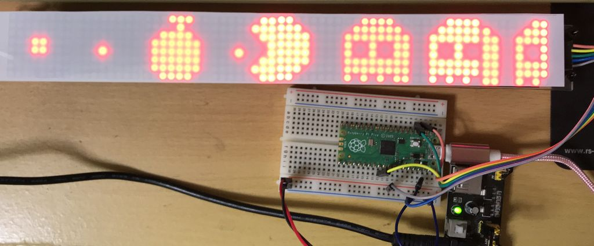
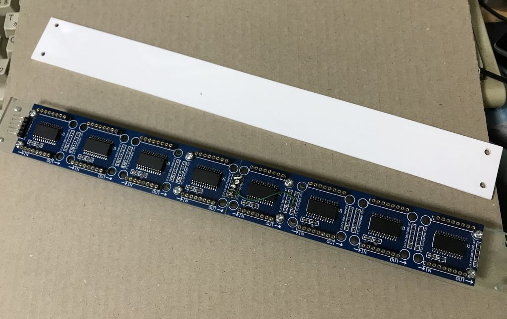
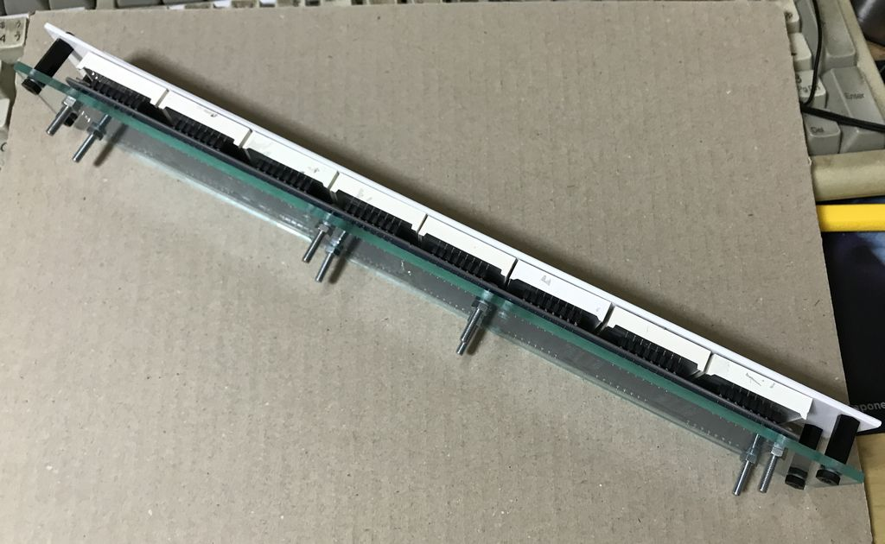
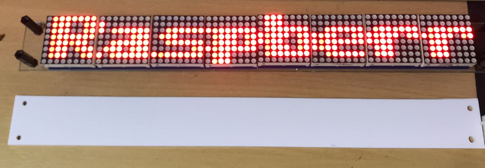
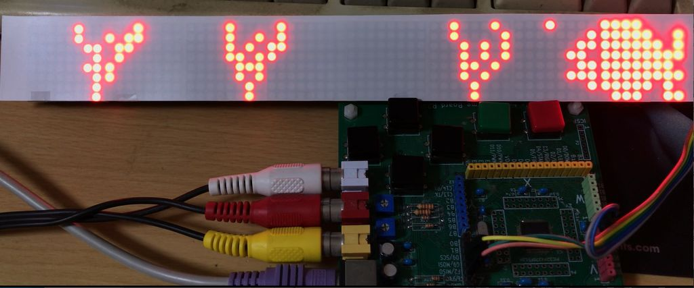
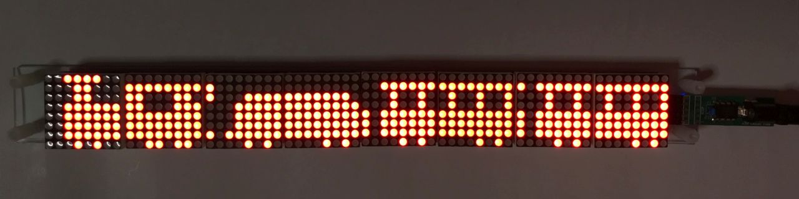

# 8連結MAX7219マトリクスLEDのマイコン制御（64x8ドット）
Amazon等で格安で購入できる4連結のMAX7219搭載マトリクスLEDを2個購入し、マイコンで制御してみました。  
制御に使ったのはRaspberry Pi PicoおよびBASICコンパイラ搭載マイコンMachiKania type Mです。  
8ビットPICマイコンPIC16F18313向けにも一部追加しました。  
動画はこちらで公開しています。  
https://youtu.be/BjLq4NHFMVI  
  
## 加工
余分なコネクタは外し、ボード同士を接続します。  
基板固定のため、アクリル板を細長く切断し、ねじ止めしました。  
また、LEDを直接見ると眩しいので、白いアクリル板やフィルム等を上から被せられるようにしました。  
  
  
  
## 公開プログラム
拡張子「py」はRaspberry Pi Pico用のPythonプログラム、「BAS」はMachiKania type M用のBASICプログラムです。  
「pic16f18313」ディレクトリに8ビットPICマイコン向けファイルも追加しています。  
  
・max7219-string.py / SPILED6.BAS  
　文字列を横スクロールして表示するプログラム  
  
・max7219-pacman.py / SPILED7.BAS  
　PACMANとモンスターが動くアニメーション  
  
・max7219-bounce.py / SPILED8.BAS  
　縦置きして、複数のボールが落ちてきて跳ねるアニメーション  
  
・max7219-goldenfish.py / SPILED9.BAS  
　水草の揺れる水槽を金魚が泳ぎ回るアニメーション  
  
  
・HEIKE.BAS  
　縦置きにして横8ドットの中に文章を縦スクロールで表示するプログラム  
　MachiKania type M専用  
　濃淡表示対応と縦方向の4倍補間で線の多い漢字も認識可能  
　サンプルデータ　heike3.bmp, heik34.bmp  
　（参考）https://twitter.com/KenKenMkIISR/status/1446828611030245383  
  
・PIC16F18313/train/  
　PICマイコン用鉄道アニメーション関連ファイル  
　train.hexの書き込みで実行可能  
　（参考）https://www.youtube.com/watch?v=PWXJrVMHTL0  
  
・PIC16F18313/goldenfish/  
　PICマイコン用金魚アニメーション関連ファイル  
　goldenfish.hexの書き込みで実行可能  

## 接続方法
LED用の電源はUSBからではなく、別電源を用意してください。  
  
Pico側 --------- LED側  
MOSI GPIO3 ---- DIN  
SCK GPIO2 ------ CLK  
SCS GPIO22 ----- CS  
GND ------------ GND  
+5V ------------- VCC  
  
MachiKania type M  
MOSI G9 -------- DIN  
SCK F6 ---------- CLK  
SCS D9 ---------- CS  
GND ------------ GND  
+5V ------------- VCC  
  
PIC16F18313  
RA0 ------------- DIN  
RA1 ------------- CLK  
RA4 ------------- CS  
VSS ------------- GND  
VDD ------------ VCC  
