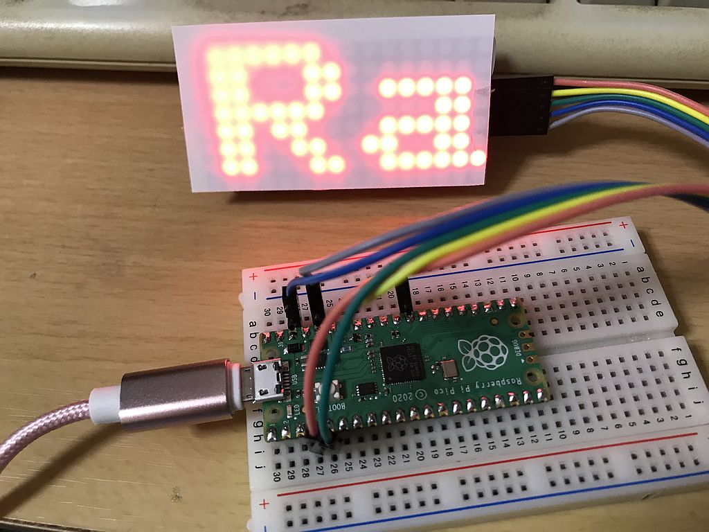

# Raspberry Pi Picoによる8x8x2マトリクスLED制御
連結されたMAX7219を使ったマトリクスLEDをRaspberry Pi PicoのSPI通信で制御しました。  
設定した文字列を横スクロール表示します。  
  
  
# 接続
Pico側 --------- LED側  
MOSI GPIO3 ---- DIN  
SCK GPIO2 ------ CLK  
SCS GPIO22 ----- CS  
+3.3V ----------- VCC  
GND ------------ GND  
