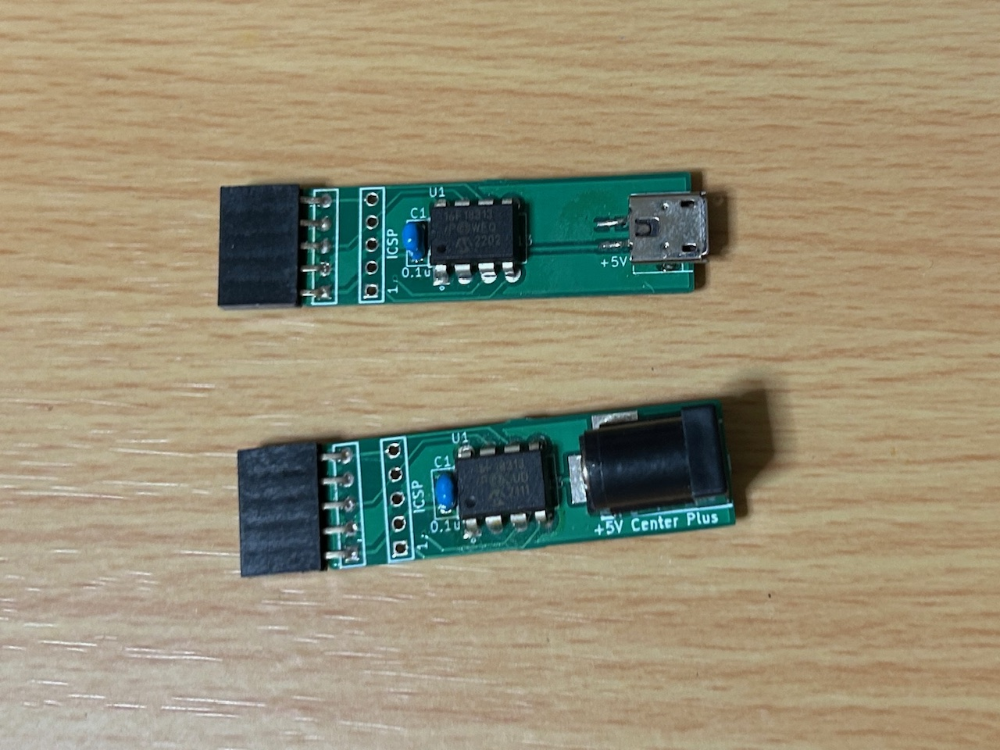
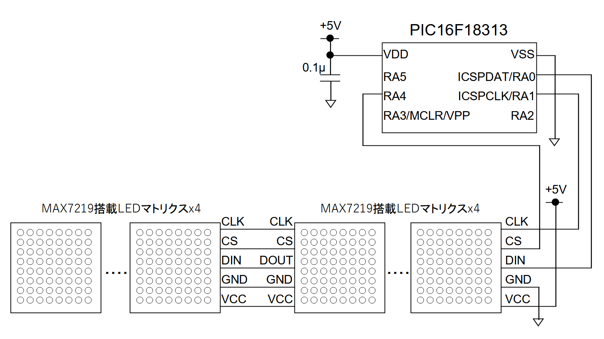

# PIC16F18313用
プリント基板を入手された方はマイコンの向きに注意して写真のように組み立ててください。5ピンのピンソケットをL字に曲げてハンダ付けします。プログラムの書き込みは、PICkitなどを使ってICSP端子から行ってください。その際、1ピン～5ピンだけを使います。6ピンは使わないのでスルーホールはありません。  
  
## 回路図
  
## 公開プログラム
・PIC16F18313/train/  
　PICマイコン用鉄道アニメーション関連ファイル  
　train.hexの書き込みで実行可能  
　（参考）https://www.youtube.com/watch?v=PWXJrVMHTL0  
  
・PIC16F18313/goldenfish/  
　PICマイコン用金魚アニメーション関連ファイル  
　goldenfish.hexの書き込みで実行可能  
